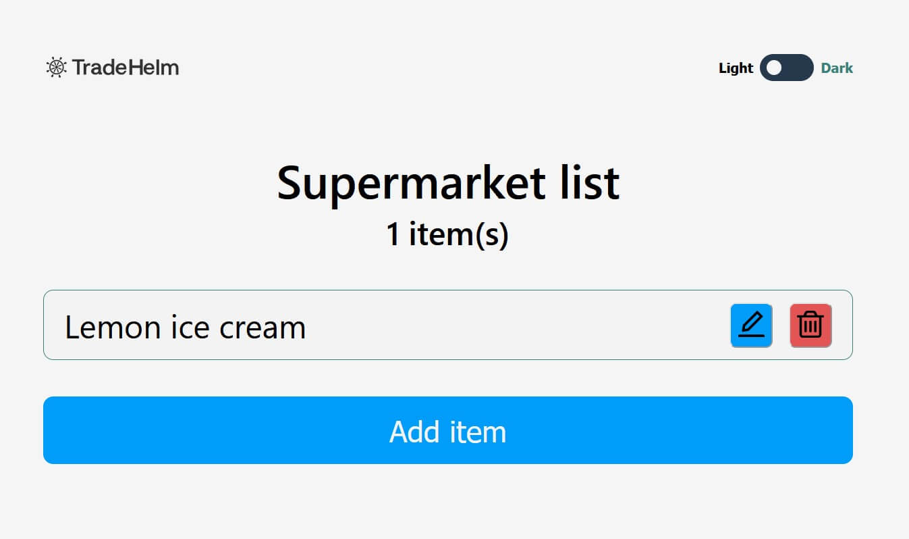

# Tradehelm Challenge

## In this Github Repository you can get all the details of the challenge.

https://github.com/goncy/tradehelm-challenge

## This is my resolution of the Tradehelm Challenge
### I use the next technologies:
- React
- Typescript
- Sass module
- Jest + React Testing Library
- Cypress
- Github Action
- Firebase for deploy

## Visit Page

https://tradehelm-challenge-20d33.firebaseapp.com/

## Figma Draft

https://www.figma.com/file/pDFMNKRdWjtgopIdlTNPhB/Tradehelm-Challenge?node-id=0%3A1

## Start Project

- git clone this repository
- npm install
- npm start

## Testing

### Unit Tests

- npm run test

### Integration Tests

- npm start
- open other terminal
- npm run cypress

